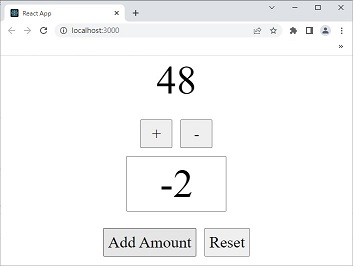

## Action Plan 

A lazy extract from [React Redux Quick Start](https://react-redux.js.org/tutorials/quick-start). 


I. Install Redux Toolkit and React Redux
```bash
npm install @reduxjs/toolkit react-redux
```


II. Create a Redux Store

app/store.js
```javascript
import { configureStore } from '@reduxjs/toolkit'

export default configureStore({
reducer: {},
})
```


III. Provide the Redux Store to React

index.js
```javascript
import React from 'react';
import ReactDOM from 'react-dom/client';
import './index.css';
import App from './App';
import { store } from './app/store'
import { Provider } from 'react-redux'

const root = ReactDOM.createRoot(document.getElementById('root'));
root.render(
  <React.StrictMode>
    <Provider store={store}>
    <App />
    </Provider>  
  </React.StrictMode>
);
```


IV. Create a Redux State Slice

Splitting up redux state object into multiple slices of state. So, a slice is really a collection of reducer logic of actions for a single feature in the app. 

For example, a blog might have a slice for post and another 
slice for comment to handle the logic of each differently. 
So they each get their own slice. 

> Creating a slice requires a string name to identify the slice, an initial state value, and one or more reducer functions to define how the state can be updated. Once a slice is created, we can export the generated Redux action creators and the reducer function for the whole slice.

features/counter/counterSlice.js
```javascript
import { createSlice } from '@reduxjs/toolkit'

const initialState = {
    count: 0
}
export const counterSlice = createSlice({
    name: 'counter',
    initialState, 
    reducers: {
        increment: (state) => {
            state.count++; 
        },
        decrement: (state) => {
            state.count--; 
        },
        reset: (state) => {
            state.count = 0 
        },
        incrementByAmount: (state, action) => {
            state.count += action.payload
        }
    }
})

export const { increment, decrement, reset, incrementByAmount } = counterSlice.actions 
export default counterSlice.reducer
```


V. Add Slice Reducers to the Store

> By defining a field inside the reducers parameter, we tell the store to use this slice reducer function to handle all updates to that state.

app/store.js
```javascript
import counterReducer from '../features/counter/counterSlice'

export const store = configureStore({
    reducer: {
        counter: counterReducer
    }

})
```


VI. Use Redux State and Actions in React Components

> Read data from the store with useSelector, and dispatch actions using useDispatch. 

features/counter/Counter.js
```javascript
import { useSelector, useDispatch } from "react-redux"
import { increment, decrement, 
         reset, incrementByAmount } from './counterSlice'
import { useState } from "react"

const Counter = () => {
    const count = useSelector(state => state.counter.count)
    const dispatch = useDispatch()
    
    const [ incrementAmount, setIncrementAmount ] = useState(0)
    const addValue = Number(incrementAmount) || 0
    
    const resetAll = ()=> {
        setIncrementAmount(0)
        dispatch(reset())
    }

  return (
    <section>
        <p>{count}</p>
        <div>
            <button onClick={() => dispatch(increment())}>+</button>
            <button onClick={() => dispatch(decrement())}>-</button>
        </div>
        <input type='text' 
               value={incrementAmount} 
               onChange={ e=> setIncrementAmount(e.target.value)}
               />

        <div>
            <button onClick={ ()=> dispatch(incrementByAmount(addValue)) }>
                Add Amount
            </button>
            <button onClick={ resetAll }>
                Reset
            </button>
        </div>
    </section>
  )
}

export default Counter
```


VII. Output screen 




VIII. Reference 
1. [React Redux Quick Start](https://react-redux.js.org/tutorials/quick-start)
2. [Redux Fundamentals, Part 1: Redux Overview](https://redux.js.org/tutorials/fundamentals/part-1-overview)
3. [Redux Fundamentals, Part 2: Concepts and Data Flow](https://redux.js.org/tutorials/fundamentals/part-2-concepts-data-flow)
4. [Redux Fundamentals, Part 3: State, Actions, and Reducers](https://redux.js.org/tutorials/fundamentals/part-3-state-actions-reducers)
5. [Redux in 100 Seconds](https://youtu.be/_shA5Xwe8_4)


## EOF (2022/12/16)